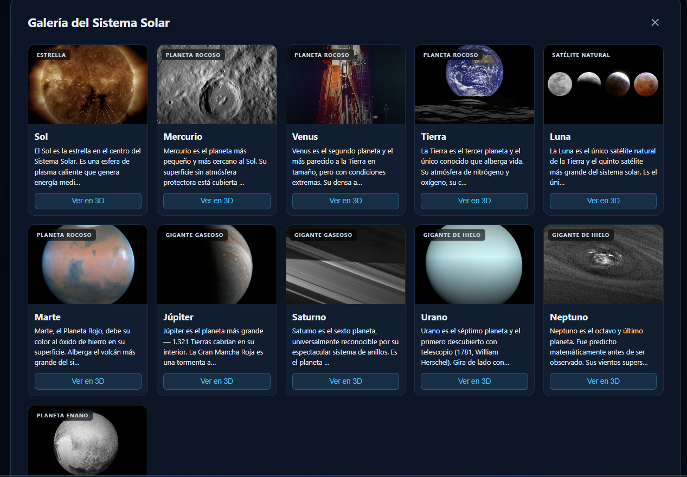
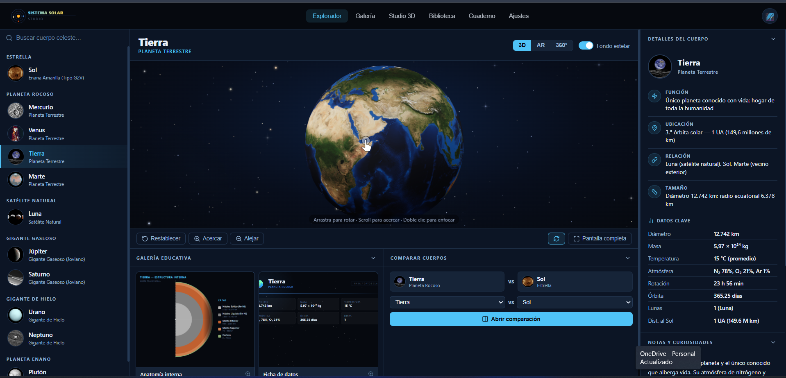

# 🌌 Sistema Solar Studio

Aplicativo web educativo interactivo para explorar el Sistema Solar en 3D, permite visualizar modelos GLB reales de la NASA, comparar cuerpos celestes, tomar notas y ensamblar el sistema solar desde cero en un modo de juego 3D.

---

## Capturas de pantalla

| Explorador 3D | Studio de Ensamblaje |
|---|---|
|  |  | 

---

## Características principales

### Explorador 3D
- **11 cuerpos celestes** con modelos GLB reales de NASA: Sol, los 8 planetas, la Luna y Plutón
- Visor `@google/model-viewer` con controles de cámara, zoom, auto-rotación y pantalla completa
- Modos de vista: **3D**, **AR** (Realidad Aumentada en móvil) y **360°** (rotación automática)
- Toggle de **fondo estelar animado** con canvas HTML5 (nebulosas, estrellas con parpadeo y rayos de difracción)
- Panel izquierdo con miniaturas circulares reales de cada cuerpo + nombre + clasificación
- Panel derecho con **iconos Lucide** mostrando Función, Ubicación, Relación y Datos Clave
- Notas clínicas con dato curioso destacado y lista de curiosidades

### Galería educativa (debajo del visor)
- Miniaturas de **Anatomía interna** (diagrama de capas) y **Ficha visual de datos** — clic para ampliar en lightbox
- Widget de comparación inline con chips visuales — abre tabla completa lado a lado

### Vistas de navegación
| Vista | Descripción |
|---|---|
| **Explorador** | Visor 3D principal |
| **Galería** | Grid completo de los 11 cuerpos con fotos NASA y botón "Ver en 3D" |
| **Studio 3D** | Modo ensamblaje interactivo (Three.js) |
| **Biblioteca** | Índice clickeable de todos los cuerpos por categoría |
| **Cuaderno** | Notas personales por cuerpo celeste, guardadas en `localStorage` |
| **Ajustes** | Preferencias de fondo, rotación y pistas de controles |

### Studio 3D (`studio.html`)
- Escena Three.js con vista cenital del sistema solar
- 11 cuerpos celestes para colocar haciendo clic en su órbita correcta
- La Luna orbita la Tierra dinámicamente al ser colocada
- Saturno incluye su sistema de anillos
- **Auto-ensamblar**, **Deshacer** y **Reiniciar**
- Barra de progreso y banner de celebración al completar el sistema
- Panel informativo lateral con datos de cada planeta seleccionado

### Otras funcionalidades
- Secciones colapsables con estado persistido en `localStorage`
- **Toast notifications** en todas las acciones relevantes
- **Deep-linking por hash** (`#galeria`, `#biblioteca`, `#cuaderno`, `#ajustes`)
- Diseño responsive (breakpoints a 1200px, 960px y 680px)
- Tecla `Esc` cierra modales y lightboxes

---

## Estructura del proyecto

```
app 3d/
├── server.js                   # Servidor Express (puerto 3000)
├── package.json
├── generate_assets.mjs         # Genera diagramas y fichas con Playwright
│
├── app/
│   ├── index.html              # Explorador principal
│   ├── studio.html             # Modo ensamblaje 3D
│   ├── css/
│   │   ├── styles.css          # Estilos del explorador
│   │   └── studio.css          # Estilos del Studio
│   └── js/
│       ├── app.js              # Lógica principal del explorador
│       ├── data.js             # Datos de los 11 cuerpos celestes
│       ├── stars.js            # Campo de estrellas animado (Canvas 2D)
│       └── studio.js           # Motor Three.js del modo ensamblaje
│
└── app-assets/
    ├── 3D/                     # 11 modelos GLB de NASA (~62 MB)
    │   ├── Sol.glb
    │   ├── Mercurio.glb
    │   ├── Venus.glb
    │   ├── Tierra.glb
    │   ├── Luna.glb
    │   ├── Marte.glb
    │   ├── Jupiter.glb
    │   ├── Saturno.glb
    │   ├── Urano.glb
    │   ├── Neptuno.glb
    │   └── Pluton.glb
    ├── miniaturas/             # 11 fotos JPG (NASA Images API)
    ├── anatomia/               # 11 diagramas PNG de estructura interna
    ├── datos_importantes/      # 11 fichas visuales PNG de datos clave
    ├── imagenes/               # 11 fotos panorámicas JPG de NASA
    └── identidad/
        ├── logo.svg
        └── favicon.svg
```

---

## Cómo ejecutar

### Requisitos
- [Node.js](https://nodejs.org/) v18 o superior

### Instalación y arranque

```bash
# 1. Entrar a la carpeta del proyecto
cd "app 3d"

# 2. Instalar dependencias
npm install

# 3. Iniciar el servidor
npm start
```

Abrir en el navegador: **http://localhost:3000**

> Los modelos 3D GLB requieren un servidor HTTP para cargarse correctamente. No abrir `index.html` directamente desde el sistema de archivos.

### Generar assets (opcional)
Si necesitas regenerar los diagramas de anatomía, fichas de datos o descargar fotos panorámicas:

```bash
node generate_assets.mjs
```

Requiere Playwright instalado como devDependency (`npm install`).

---

## Stack tecnológico

| Tecnología | Uso |
|---|---|
| [`@google/model-viewer`](https://modelviewer.dev/) v3.5 | Renderizado interactivo de modelos GLB + AR |
| [Three.js](https://threejs.org/) v0.160 | Escena 3D del modo ensamblaje |
| [Lucide Icons](https://lucide.dev/) | Sistema de iconos SVG |
| [Express.js](https://expressjs.com/) | Servidor estático local |
| Canvas 2D API | Campo de estrellas animado con nebulosas |
| [Playwright](https://playwright.dev/) | Generación de assets PNG (diagramas y fichas) |
| Vanilla JS (ES Modules) | Sin frameworks frontend |

---

## Fuentes y créditos

| Recurso | Fuente |
|---|---|
| Modelos GLB 3D | [NASA Solar System Exploration](https://science.nasa.gov/solar-system/) · `assets.science.nasa.gov` |
| Modelo de la Luna | [NASA SVS](https://svs.gsfc.nasa.gov/) |
| Fotos panorámicas | [NASA Images API](https://images.nasa.gov/) |
| Datos científicos | NASA Planetary Fact Sheets |


---

## Licencia

Proyecto educativo de uso libre. Los modelos 3D y fotografías son propiedad de NASA y están sujetos a su política de uso público. El código fuente puede reutilizarse con fines educativos.
